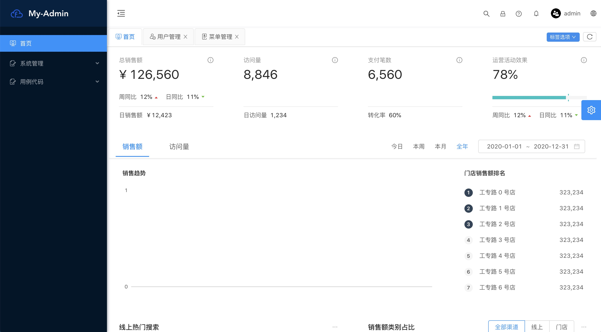

[TOC]

## 入门

### 摘要

​ 该工程是基于antPro2进行个性化改装，目的是为了能快速结合实际业务开。详情 <https://pro.ant.design/docs/getting-started-cn>

### 特殊说明

- 基于 antd 多Tab页菜单切换功能添加（可缓存页面）
- 工程针对咱们自己业务系统进行了一些特殊封装
- 工程中加入了mobx 用于方便大家开发（redux 依然有，但是门槛较高）
- 用户、角色、菜单管理基本功能已经完成
- 登陆，以及配置已经做了咱们的个性化
- 相关组件重构，性能进行了优化，功能也做了加强。
- 其他还在建设中 。。。

### 前序准备

你的本地环境需要安装 [yarn](https://yarnpkg.com/)、[node](http://nodejs.org/) 和 [git](https://git-scm.com/)。我们的技术栈基于 [ES2015+](http://es6.ruanyifeng.com/)、[React](http://facebook.github.io/react/)、[UmiJS](https://umijs.org/)、[dva](http://github.com/dvajs/dva)和 [antd](https://ant.design/docs/react/introduce-cn)，提前了解和学习这些知识会非常有帮助

### 环境搭建

#### Nodejs (version 8 +)

- 下载地址 <https://nodejs.org/zh-cn/download/>

#### 浏览器

- 这里推荐用谷歌Chrome （version 74 +）（视觉效果还是开发都是蛮不错了）
- Ie11  基本抛弃 （Mobx5 不支持ie11）edge

#### 调试工具 （主要是监控和查看数据流转情况）

​	`都可以通过谷歌商城下载，若不能访问谷歌商城，建议下载360谷歌访问助手或者蓝灯等等（翻墙的软件）`
 `或者下载谷歌双核浏览器，可以方便下载插件`

- React Developer Tool   （可以查看到React组件的属性变量等等）
- MobX Developer Tool   （可以查看到mobx的store属性函数等等）
- Redux DevTools   （可以看到redux中数据流到变化和函数调用等等）

### 工程安装

#### 代码下载

  代码从gitee  <https://gitee.com/W006/myadmin.git> 下载

#### 下载工程依赖

```shell
cnpm install  ## npm install (阿里快一点)
```

or 

```shell
yarn install
```

#### 工程

```shell
npm start
```

or

```shell
yarn install
```


#### 访问应用

启动成功后，控制台会显示地址和端口

```shell
xxxMacBook-Pro:myadmin wen$ npm start
 ...
  App running at:
  - Local:   http://localhost:6060/ (copied to clipboard)
  - Network: http://192.168.43.234:6060/
```

##### 地址：http://localhost:6060

##### 登陆页面：用户名/密码：admin/1


#### 登陆后的页面展示

##### 多切页




##### 面包屑


### 目录结构

```
├── config                   # umi 配置，包含路由，构建等配置
|		├── routes							 # 根据业务模块路由配置
├── doc                      # 文档图片
├── mock                     # 本地模拟数据
├── docker									 # 容器配置文件
├── public
│   └── favicon.png          # Favicon
├── src
│   ├── assets               # 本地静态资源
│   ├── components           # 业务通用组件
│   ├── e2e                  # 集成测试用例
│   ├── layouts              # 通用布局
│   ├── models               # 全局 dva model
|		├── stores							 # 业务store处理业务逻辑的
|   		├── common					 # 通用全局的store
│   ├── pages                # 业务页面入口和常用模板
|			  ├── plugins					 # 业务组件
|			  ├── common.less			 # 业务通用样式
│   ├── services             # 后台接口服务
|			  ├── config					 # 存放后台服务配置的
|			  ├── ServiceHandler.js# 通用的调用后台的
│   ├── utils                # 工具库
|   	  └── app.conf.js			 # 服务配置
│   ├── locales              # 国际化资源
|   ├── defaultSettings.js	 # 全局的默认配置布局，标题，样式等等
│   ├── global.less          # 全局样式
│   └── global.js            # 全局 JS
├── tests                    # 测试工具
├── README.md
└── package.json
```


## 构建和部署

### 构建 

- **构建** 当要发布生产的时候通过下面方式构建

  打包成功后会在当前目录生成一个dist文件

```shell
npm run build
```

- **分析构建文件体积**

  如果你的构建文件很大，你可以通过 `analyze` 命令构建并分析依赖模块的体积分布，从而优化你的代码。

```shell
npm run analyze
```


### 部署

#### nginx 前后台分离部署

nginx.conf (工程的docker文件夹有配置文件)

```
# msa.web.ip:port 指定后台服务地址和ip
server {
    listen 80;
    # gzip config
    gzip on;
    gzip_min_length 1k;
    gzip_comp_level 9;
    gzip_types text/plain application/javascript application/x-javascript text/css application/xml text/javascript application/x-httpd-php image/jpeg image/gif image/png;
    gzip_vary on;
    gzip_disable "MSIE [1-6]\.";

    root /usr/share/nginx/html;

    location / {
        # 用于配合 browserHistory使用
        try_files $uri $uri/ /index.html;

        # 如果有资源，建议使用 https + http2，配合按需加载可以获得更好的体验
        # rewrite ^/(.*)$ https://msa.web.ip:port/$1 permanent;

    }
    location /api {
        proxy_pass https://msa.web.ip:port;
        proxy_set_header   X-Forwarded-Proto $scheme;
        proxy_set_header   X-Real-IP         $remote_addr;
    }
}

server {
  # 如果有资源，建议使用 https + http2，配合按需加载可以获得更好的体验
  listen 443 ssl http2 default_server;

  # 证书的公私钥
  ssl_certificate /path/to/public.crt;
  ssl_certificate_key /path/to/private.key;

  location / {
        # 用于配合 browserHistory使用
        try_files $uri $uri/ /index.html;

  }
  location /api {
      proxy_pass https://msa.web.ip:port;
      proxy_set_header   X-Forwarded-Proto $scheme;
      proxy_set_header   Host              $http_host;
      proxy_set_header   X-Real-IP         $remote_addr;
  }
}

```


#### springboot 放入容器部署

然后将编译之后的文件复制到 spring boot 项目的 `/src/main/resources/static` 目录下。

重新启动项目，访问 `http://localhost:8080/` 就可以看到效果。

为了方便做整合，最好使用 hash 路由（url带有#的）。如果你想使用 browserHistory ，可以创建一个 controller ，并添加如下代码：

```java
@RequestMapping("/api/**")
public ApiResult api(HttpServletRequest request, HttpServletResponse response){
    return apiProxy.proxy(request, reponse);
}

@RequestMapping(value="/**", method=HTTPMethod.GET)
public String index(){
    return "index"
}
```


## 本地开发

### 1.新增js和less @/pages/

- **建文件夹**sys/demo/

- **建文件**

  - NewPage.js 列表页面

  ```jsx
  import React from 'react';
  import styles from './index.less'
  class NewPage extends React.Component {
    render(){
      return <div className={styles.adMain}>Hello</div>
    }
  }
  
  ```

  - index.less

  ```less
  .adMain{
    font-size:100px;
    color:blue;
  }
  
  ```

### 2.加入菜单和路由 

- **菜单** mock/mock.data.js 这里是模拟的菜单

  ```js
     {
          "id": 10006,
          "menuCode": "10006",
          "menuName": "新页面",
          "parentId": 100, // 上级菜单id
          "url": "/sys/demo/demoIndex", // 这个要和路由配置的对应上
          "icon": "huijipingzhengyinqing", 
      },
  
  ```

- **路由**在`config/routes/`sys.js 加入配置

  ```js
  {
    path: `/sys/demo/demoIndex`, # 路由地址（这个和菜单的URL、要一致）
    name: '新页面', # 模块名称
    author: 'neusoft',  # 作者
    component: `./sys/demo/NewPage`, # 页面位置，这里"."代表@/pages/
  }
  ```

### 3.新增store 或者 modal

​ 复杂的页面难免会写一大堆逻辑，为了让页面和逻辑分开这里就需要处理数据流的store或者modal

   `这里建一个store或者modal就可以了，推荐store`

- store
- modal

### 4.配置 services/config

   需要调用后台服务的时候在这里配置一下

### 5.配置服务或者mock

  前后台分离开发的时候，前端可以通过配置模拟数据来做开发。

### 访问页面
